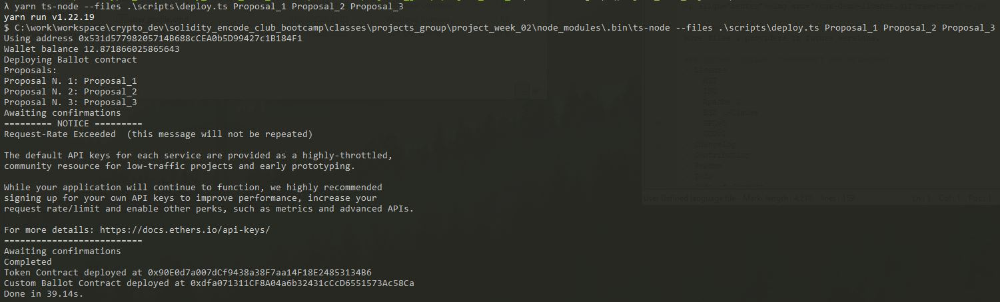
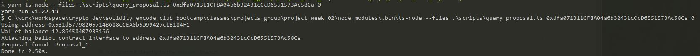

[](https://dl.circleci.com/status-badge/redirect/gh/Encode-Club-Solidity-Group-14/project_week_02/tree/main)
[](https://codecov.io/gh/Encode-Club-Solidity-Group-14/project_week_02)

# Weekend project 2

- Form groups of 3 to 5 students
- Complete the contracts together
- Structure scripts to
  - Deploy everything
  - Interact with the ballot factory
  - Query proposals for each ballot
  - Operate scripts
- Publish the project in Github
- Run the scripts with a few set of proposals, play around with token balances, cast and delegate votes, create ballots from snapshots, interact with the ballots and inspect results
- Write a report detailing the addresses, transaction hashes, description of the operation script being executed and console output from script execution for each step
- (Extra) Use TDD methodology

**Getting Started**

Before everything, clone the project:

```
git clone https://github.com/Encode-Club-Solidity-Group-14/project_week_02.git
```

**Building**

```
yarn install
```

```
yarn hardhat compile
```

**Tests**

```
yarn hardhat test
```

# Scritps Usage

**Deploy Everything**

Script: ``deploy.ts {list_of_proposals}``

```
yarn ts-node --files .\scripts\deploy.ts Proposal_1 Proposal_2 Proposal_3
```



**Result:**

- Token Contract deployed at [0x90E0d7a007dCf9438a38F7aa14F18E24853134B6](https://ropsten.etherscan.io/address/0x90E0d7a007dCf9438a38F7aa14F18E24853134B6)

- Custom Ballot Contract deployed at [0xdfa071311CF8A04a6b32431cCcD6551573Ac58Ca](https://ropsten.etherscan.io/address/0xdfa071311CF8A04a6b32431cCcD6551573Ac58Ca)

**Query Proposals**

Script: ``query_proposal.ts {custom_ballot_address} {proposal_index_to_query}``

```
yarn ts-node --files .\scripts\query_proposal.ts 0xdfa071311CF8A04a6b32431cCcD6551573Ac58Ca 0
```




